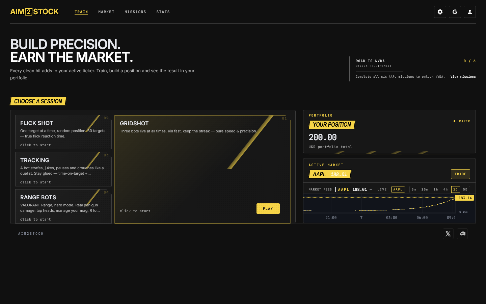
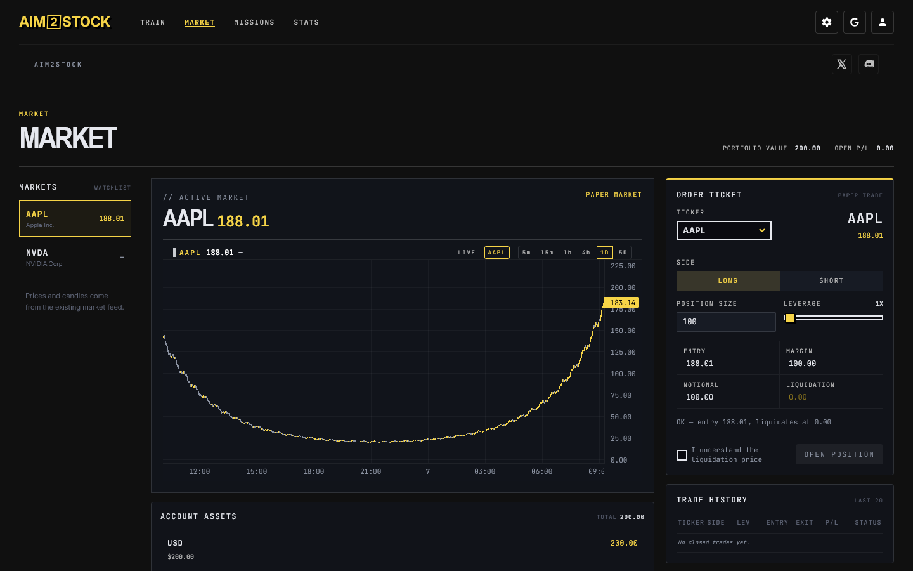

# aim2stock

A browser aim-trading game. Aim hits in a 3D arena farm simulated units of real-market tickers; a separate paper-trading terminal uses real charts and lets you buy, sell, long, short, and run positions up to 20x leverage. Every aim hit, every order, every P/L is server-validated. All money is play money.

This is the `mvp-v0.1` release. It is a fully playable single-player loop on top of a valotrainer aim engine. No real money, no broker, no debt, no withdrawals.



## What it is

- **Aim loop**: Gridshot / Flick modes on a ported valotrainer engine. Each hit emits a `vibes:hit` event; a client bridge POSTs it to the server; the server mints simulated units of the active ticker. AAPL is available from the start; NVDA unlocks only after the full mission chain.
- **Chart widget**: top-right corner. 1D / 5D ranges, AAPL / NVDA tickers, polling every second, and a stale label after 5 seconds. The default offline provider is visibly simulated; an optional configured provider supplies live quotes.
- **Trading terminal**: full-height panel with holdings, open positions, history, long/short orders, leverage from 1× to 20×, and a liquidation preview. `notional` is position exposure; reserved collateral is `notional / leverage`. New orders are blocked with `409 market_closed` when a live provider reports a closed US session; closing an existing position remains available.
- **Missions panel**: 6 AAPL-chain missions. `hold_60s` requires a real closed long held for at least 60,000 ms; `precise_session` requires recorded aim accuracy of at least 70%. Claim all six to unlock NVDA.
- **Progress**: a new player starts with 200 Stable. The client keeps a local guest snapshot; the default server store is in-memory for the running process. Configure Supabase to persist server-side progress across restarts.



## Quick start

You need Node.js >= 20, a static file server for the client, and a single Node process for the server. The project ships with **no npm dependencies** — pure-Node http server, no Express.

```bash
# 1. Run the server (defaults to port 3000)
node server/src/index.js

# 2. In another terminal, serve the client on port 4173
npx --yes serve -p 4173 client

# 3. Open http://127.0.0.1:4173
```

The first paint shows a `aim2stock` boot card. It pings `http://127.0.0.1:3000/health`. If reachable, the menu and the chart panel appear. If not, the boot card shows a one-line explanation and a `Skip` button so the player can still look at the menu.

The client reads the API base from `window.VIBES_API_BASE` or falls back to `http://127.0.0.1:3000`. To point at a different host, set it on the host page or via the boot card's `Skip` flow.

## Run the tests

```bash
# Fast suite: 16 no-install Node/browser suites
npm test

# Separate real-time mission proof: waits at least 60 seconds
npm run test:slow
```

`npm test` needs no `npm install`. Its visual smoke uses Python + Playwright + Chromium when available; otherwise that one browser suite reports a skip while the Node suites still run. When available, it asserts the interactive UI plus zero browser console, request, API, and static-host errors.

## Architecture

```
client/                          server/                       tests/
├── index.html                   ├── src/
├── src/                         │   ├── index.js              ├── *.test.mjs
│   ├── api.js                   │   ├── config.js             ├── visual_smoke.py
│   ├── store.js                 │   ├── router.js
│   ├── bootstrap.js             │   ├── util/json.js
│   ├── session.js               │   ├── market/
│   ├── persist.js               │   │   ├── provider.js
│   ├── terminal-core.js         │   │   ├── stub.js
│   ├── missions-core.js         │   │   ├── finnhub.js
│   └── chart.js (in js/)        │   │   └── index.js
├── js/                          │   ├── db/
│   ├── aim-bridge.js            │   │   ├── store.js (in-memory)
│   ├── chart.js                 │   │   └── supabase.js (PostgREST)
│   ├── terminal.js              │   └── routes/
│   ├── missions.js              │       ├── health.js
│   └── main.js (valotrainer)    │       ├── market.js
├── css/                          │       ├── aim.js
│   ├── upstream.css (valotrn)   │       ├── portfolio.js
│   └── style.css (vibes)        │       ├── missions.js
└──                              └── migrations/
                                     ├── 0001_init.sql (Supabase schema)
                                     └── 0002_add_precise_best.sql (existing-player upgrade)
```

The aim engine is `valotrainer @ ded498f5` (MIT) — modes, weapons, ballistics, crosshair editor, sensitivity sync, the works. We added one line to its `markHit` to emit `vibes:hit` on `window`; everything else is the upstream engine.

The server is pure-Node `http` + a tiny Express-shaped router. No Express, no Koa, no Fastify. The only env vars it reads are `PORT`, `ORIGIN`, `MARKET_PROVIDER`, `FINNHUB_TOKEN`, `SUPABASE_URL`, `SUPABASE_SERVICE_KEY`, `AIM_HIT_RPS`, `AIM_HIT_UNIT`, `AIM_PRICE_IMPACT_MAX`. See `server/.env.example`.

The market data adapter is provider-neutral. `createMarketProvider({ provider, finnhubToken })` returns either a `stub` (deterministic offline) or a `finnhub` (real, requires token). Switching providers is one env-var.

The persistence layer is also backend-agnostic. `pickStore(supabaseConfig)` returns a Supabase-backed store if both `url` and `serviceKey` are present, otherwise the in-memory store. The Supabase adapter is built on the project's `fetch` (no `@supabase/supabase-js` dependency) and uses PostgREST directly.

The client store (`client/src/store.js`) is a thin layer over `fetch` that mirrors the server's state. It uses `localStorage` for guest persistence and falls back to server state on every page load.

## How the aim → ticker → trade loop works

```
engine markHit(head)        [valotrainer]
        |
        v
window 'vibes:hit'         [client/js/game.js, 1 line added]
        |
        v
client/js/aim-bridge.js    [listens, generates hitId, POST /aim/hit]
        |
        v
server/src/routes/aim.js   [rate-limit, idempotency, mint unit, credit balance]
        |
        v
server/src/db/store.js     [in-memory or Supabase PostgREST]
        |
        v
client/src/store.js        [refreshes, re-renders HUD chip + chart + terminal]
        |
        v
chart.js + terminal.js     [re-render with new state]
```

Server is the **only** place that mints simulated units. A client cannot fake a hit; the server checks `sessionId + hitId` for idempotency and rate-limits per session.

## Real money, real markets

- No. All money is play money. There is no broker integration, no withdrawal, no deposit. The chart shows real prices for visual realism, but the trades you make are entirely on a paper ledger.
- Pre-IPO tickers (OPENAI, ANTHROPIC) are listed as `pre_ipo: true` with `price: null`. The terminal refuses to open positions on them with a clear 400 response.
- Leverage is clamped to `[1, 20]`. Liquidation is computed at `entry * (1 ± 1/leverage)`. On liquidation the position closes and the margin is fully lost; stable is never negative.

## Deploy notes

The server is a single Node process. It reads `PORT` (default 3000). For a real deploy:

- **Render free tier**: `node server/src/index.js` as the start command, `PORT` is set by Render, `ORIGIN` should match the static client's URL.
- **Vercel** can host the `client/` as a static site. The server can run on Vercel as a Serverless Function with the `api/` shim, but the no-dep policy means writing that shim is on you.
- **Supabase** is the optional persistence backend. Run `server/migrations/0001_init.sql`, then `server/migrations/0002_add_precise_best.sql`, set `SUPABASE_URL` and `SUPABASE_SERVICE_KEY`, and the store automatically switches to Supabase. Without it, the in-memory store lasts only for the Node process lifetime.

See `server/.env.example` for the full env-var list.

## License

MIT. See [LICENSE](LICENSE).

The aim engine is `valotrainer @ ded498f5` (MIT) by Pratilectron. We use it as a base and add a single `window.dispatchEvent` line inside `markHit` to bridge engine hits to the rest of the game.

## Acknowledgements

- valotrainer — the aim engine. https://github.com/Pratilectron/valotrainer
- TradingView Lightweight Charts — the chart widget. https://github.com/tradingview/lightweight-charts
- Finnhub — the real-market data provider. https://finnhub.io
- Supabase — the production persistence backend. https://supabase.io
